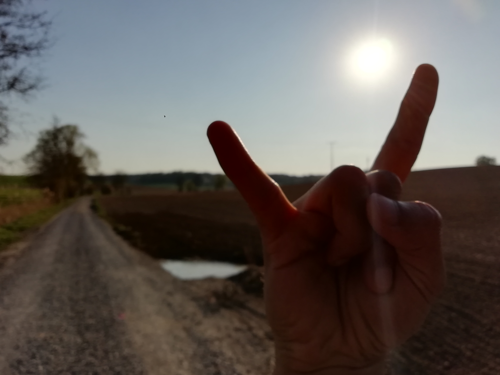

---------DISCLAIMER BEGIN---------

This is something I originally wrote around the time I wrote [that](https://stacker.news/items/349363) as you might guess while reading this.

I don't remember if I wrote this before or after, all I know is that I wrote a lot. Like really A LOT. [I filled stacks of notes](https://stacker.news/items/453876) with all the things that I wanted to write about in some longer, more clever, inspiring and fun-to-read form at some point in my life. However, I wanted to do this without basically committing social suicide if it wasn't necessary. I took notes of everything I hate about the world and every single person in it. Didn't matter if I never met you, you're in this world and that was reason enough to tell you exactly how I feel about you.

> Some men just want to watch the world burn.

In what I wrote, everyone except me was dead wrong about everything, doesn't matter whatever their position was. Even if it was my position, they were still wrong since it made sense to assume that if they were right, they were right for the wrong reasons. I felt like no one could see things like I do. No one would get me and certainly not "it". I felt like I must know everything now since I no longer even require sleep. I felt like I have ascended and it's lonely at the top. I almost convinced myself that I was Satoshi reincarnated but I just forgot. But it didn't matter since [@WeAreAllSatoshi](https://stacker.news/WeAreAllSatoshi) anyway, right? All of these feelings showed in my notes. Like really A LOT.

For hopefully obvious reasons, I sent the first draft to no one else but [@DarthCoin](https://stacker.news/DarthCoin). I needed someone to read over what I wrote so far and tell me I am not crazy. I felt like a genius and a madman at the same time and the coin to seal my fate as one or the other was still flipping in the air but it was coming down fast. Or if I was a goner I needed someone to tell me I am at least going out with a bang.

> _That's why people will remember my nym._

He didn't say I was not crazy but he liked what he read and wanted to read more. That was very encouraging but it was all I had though. Now, three months have passed since December 13, the Wednesday I sent [@DarthCoin](https://stacker.news/DarthCoin) that first draft and it's still mostly all I have. Fortunately, I did send it to him since I wasn't able to find the draft on my machine anymore after [this post](https://stacker.news/items/452688) from [@siggy47](https://stacker.news/siggy47) inspired me to finally publish it in its current form. So if I didn't do this, I would have nothing now. Coincidence? Probably but isn't it more fun to selectively believe in destiny? As long as you don't blast your mental diarrhea into the world wide web[^1], or at least not under your nym?

Anyway, I didn't know if I was going to ever publish my feelings and let everyone know exactly what I think of them since it felt like I couldn't stop writing:

> _Would I have enough time in my life to ever finish writing? To finish my thoughts? Or would I die in the most ridiculous way possible tomorrow? Snuffed out like a candle with all my dreams and aspirations [in an instant](https://www.goodreads.com/book/show/51037979-in-an-instant)? No time to ask for pen and paper in my last moments? At least it would be fun and painless, I guess. But would anyone care if one more light goes out? Would I care?_



Whatever I did, there was always something I needed to write down RIGHT NOW. And that never seemed to be code.

During this time, I was literally afraid that I would forget the most important epiphanies I had—or what felt like epiphanies in the moments. I was afraid that I would lose this new perspective on life that I gained by involuntarily not being able to sleep for days. I was afraid that I would just slip into my old ways sooner or later. Maybe that was the most important reason why I couldn't sleep: Deep inside, I had this primordial fear that I would wake up and everything would be normal as in [SNAFU](https://en.wikipedia.org/wiki/SNAFU) again. Like a bad trip ending except the bad trip starts right where it left off.

I think at the end, I only got 6 hours of sleep during the week. I remember this since I mentioned this between a lot of very toxic messages to my ex-girlfriend while we were about to have an argument about something stupid again. I do regret how I wrote some things but at least I can confidently say that I don't regret what I wrote. It wasn't nice but I needed it and I actually don't know how I could have gotten my point across as effective but less toxic so maybe I don't regret it at all when considered from this perspective.

However, I certainly hoped that maybe she needed this, too. In fact, I was so sure I was doing her a service. I thought that in time, she would certainly understand that all I ever wanted was to be there for her just like she was there for me even though I admit I was really bad at it at times. I thought that in time, she would find the "true meaning" between all these cruel but in some absolute crazy way still well-meaning messages. And then it would have been worth it even if it meant she will never write me again. And I can understand that. But in the end, all that mattered was maybe just that I was the hero in my own movie, lol.

The end of this streak of insomnia started with me thinking "Hey, wouldn't it be a great time to go bouldering again?". I was able to boulder. Everything felt normal. Everything felt great! Until I arrived home and started emptying the washing machine. I was hanging up my clothes but at some point I noticed that something is off. They weren't wet. Like not wet at all. I thought maybe they already dried a little bit... inside the washing machine.

Fortunately, my prefrontal cortex was still active enough to realize that NO FUCKING WAY the clothes can be this dry or get so dry inside a washing machine even if they would have been in there for hours or even days.

I went to the washing machine and started to laugh hysterically: I forgot to put the machine on before I left. Everything was still configured and it was waiting for me to press start. I started the washing machine then (with my clothes in it) and suddenly felt very tired to not say about to pass out. I barely made it into bed and slept for 10 hours.

Uninterrupted sleep like that was something that I thought I was finally not capable of anymore. "Sleep is for the weak!", I told myself and "finally" because I still remember the nights during my childhood where I was getting increasingly worried that I have forgotten how to sleep which certainly didn't help with falling asleep:

> _Oh no, I have forgotten how to sleep! What should I do with all this extra time I now have? Every night will be so boring now!_

I could only sleep for 1-2 hours per 12-36 hours for what felt like weeks. After 1-2 hours, it felt like I just had the best sleep of my life. My mind was immediately racing again. There was nothing stopping it from doing all the things it wanted to do. An unstoppable force of nature that could only be stopped for max 1-2 hours but only on its own terms. It felt like my eyes were popping out of their sockets. It felt like I was never so alive in my entire life. My heart was beating so strong and fast for prolonged periods of time for no apparent reason that it made me consider if I am actively experiencing time dilation: experiencing faster time travel while for everyone else, it looks like I am doing everything at twice the speed.

Whatever signals my body was sending must have gotten completely overriden until I realized that just a few seconds ago, I started to dry dry clothes and everything that happened in the past weeks suddenly became crystal clear. It wasn't destiny. It was mostly paranoia. I felt constantly between being extremely awake and extremely tired until all of my mental and emotional states overlapped and lying in bed was just this thing that I do to think more deeply about my next steps because for some inexplicable reason, I couldn't focus as much as I wanted to at the moment. I still remember how I associated the sound an ECG monitor makes during a flatline with how I felt and that I thought that was awesome:

> _Beeeeeeep. Sleeping or not sleeping, what's the difference? Infinite time!_

I hope this set the stage enough for what comes next.

_a picture taken on a beautiful day in Spring 2020 that I found while searching for a specific, more related picture that I didn't find_

---------DISCLAIMER END---------

---

When I was younger, my parents used to fight all the time.

Now you might ask yourself? Why am I telling you this? Because I want to make you listen to this by pretending I had a bad childhood to involve your emotions since triggering emotions in humans is a powerful tool some people might abuse to achieve all kind of things?

Guess what? This post is exactly for you fucking morons out there who don't get I am telling you this because it becomes fuckin' relevant later on WHICH SHOULD BE FUCKING OBVIOUS SINCE THAT IS HOW GOOD STORIES USUALLY WORK.

Additionally, I thought I am talking to bitcoiners here? I thought you guys think of yourself to be a low time preference bunch of people? But why am I not seeing this? Why do I cringe all the time; regret that I had faith in humanity by doing all I can to write the initial bitcoin version in secret and at some point thought:

> _Bitcoin is in good hands now. I can disappear now ..._

So let this be your first lesson: STOP FUCKING ASSUMING THINGS WITHOUT REALIZING THAT IT'S JUST A FUCKING ASSUMPTION AND NOT SOME KIND OF DIVINE INTERVENTION THAT JUST SAVED YOU FROM READING A STORY MEANT TO MANIPULATE OR PROVOKE YOU BECAUSE YOU WERE ABLE TO READ 13 FUCKING WORDS.

This rant may go down in human history, so you better start feeling some FOMO if you don't have time to read this right now ... AND YOU DON'T WANT TO BE THE FUCKING MORON WHO THOUGHT THEY KNEW WHAT THIS IS ABOUT AND THUS DIDN'T READ THIS AND THEN LATER TURNED OUT TO BE THE ONLY FUCKING MORON BECAUSE EVERYONE ELSE DID INDEED TAKE THIS SERIOUSLY, DO YOU? But let's not get ahead of ourselves, will we?

---

Once, I had an accident and I almost got paralyzed. While I was lying there, looking up where I came from, I was in the biggest pain that I ever felt in my life. I fell from a roof and onto stairs with my back.

That was the first time I felt this intense rage in myself that I felt cooking up during this bear market, checking up on you guys what you're up to ...

While I was lying there on the stairs, trying to find a position that not hurts so fuckin' much I might actually die from pain faster than from whatever other internal injury I might have suffered, someone asked me:

> Hey, what's your name?

> _ARE YOU FUCKING SERIOUS, YOU'RE ASKING ME RIGHT NOW WHAT MY FUCKING NAME IS? CAN'T YOU SEE I AM LITERALLY TRYING TO SURVIVE RIGHT NOW?! OR IF I AM NOT GOING TO FUCKING MAKE IT, CAN YOU AT LEAST [LET ME DIE IN FUCKING PEACE](https://www.youtube.com/watch?v=9TohDsmT8tA)?! ARE YOU LITERALLY RETARDED? LIKE LITERALLY? BECAUSE IF SO, YOU MIGHT SHOULD GO SEE A THERAPIST, IT MIGHT HELP YOU TO KNOW THAT YOU'RE A FUCKING MORON._

But I didn't say that. I was in too much pain to say that.

The woman that was with me called EMS and they asked her to ask me what my name is. AT LEAST THAT'S WHAT THIS FUCKING DUMB WOMAN TOLD ME SINCE SHE MIGHT HAVE REALIZED HOW FUCKING DUMB IT WAS TO ASK ME THIS AND TRIED TO BLAME THE EMS BECAUSE IT TURNED OUT, THIS STUPID FUCKING HORRIBLE WOMAN NEVER EVER FUCKING THANKED ME OR ACKNOWLEDGED IN ANY FUCKING WAY THAT I LITERALLY JUST TRIED TO FUCKING HELP HER JUST FOR THE SAKE OF FUCKING HELPING A HUMAN FUCKING PIECE OF SHIT BEING AND LITERALLY ALMOST DYING IN THE PROCESS.

So I ... I don't really remember what I said. I just felt this intense rage in myself, like am I fucking surrounded by fucking morons? Is this how I am going to die? With a moron not realizing I am dying and asking me what my name is? Really? Is this a fucking joke? Was my whole life just a cruel pretext for this single moment? If so: BRING IT ON. I AM READY. I AM SO FUCKING SICK OF THIS FUCKING SHIT, JUST DON'T MAKE IT MORE PAINFUL THAN IT REALLY HAS TO BE, OKAY?! OR AT LEAST FUCKING TELL ME, WHY DO I HAVE TO FUCKING GO THROUGH THIS, WHAT THE FUCK DID I DO WRONG IN MY FUCKING LIFE?!

But if I have to guess what I said, I would say I said:

> Is this relevant right now?

What must have felt like an eternity later, the woman asked if I can move my toes. Again, this intense rage that I never felt before in my life showed itself in my mind:

> _YOU REALLY DON'T GET IT DO YOU? I FINALLY FOUND A POSITION THAT SEEMS TO BE AT LEAST A LOCAL MINIMUM OF PAIN AND NOW YOU'RE TELLING ME I SHOULD TRY TO MOVE MY TOES? ARE YOU SERIOUS? I AM SERIOUS BECAUSE I REALLY DON'T KNOW IF THIS IS A FUCKING JOKE._

But I was actually also interested if I can still move my toes. So slowly, I tried to check what I am still capable of doing without dying right fucking now because someone asked me such a dumb fucking question. I really don't want to have written on my grave that I was killed by a dumb question while I actually fell from a roof, trying to help this woman get back into her apartment because she was too fucking dumb to take her keys with her so she locked herself out and then she asked me such a dumb fucking question I realized I don't want to live in this world anymore and I rather just die and move on, whatever the fuck comes after it. It can't be worse than this, right? Right?

Fortunately, I think there was still some sense in my toes. I am not even sure if I did indeed move my toes. I might just tried to channel all the energy that was still left in me to check if I still feel at least _something_ there.

> _Can I feel the shoe that I am wearing? Please, oh god please, even though I am not religious because my parents are and they are fucking horrible, please god, if you exist in whatever kind of form. At least tell me if I can still feel my toes without increasing this pain I am feeling that I am wondering why I am still conscious. IF YOU AT LEAST COULDN'T FUCKING SAVE ME FROM FALLING ON THESE FUCKING STAIRS JUST BECAUSE I DIDN'T LOOK AT WHAT I WAS STEPPING ON WHILE I WAS BLINKING MY EYES._

What feels like another eternity later, I replied:

> Yes, I can still feel my toes.

Then I must have lied there for more than a few seconds. In my memory, it feels like the EMS immediately showed up.

When the emergency doctor walked over to me, I got really scared. Like extremely, extremely scared. I was already scared that I am going to die, but this guy walking over to me? That was what might actually scared me more than death in that moment.

I was scared because I knew he was going to try something. He was going to do something SO FUCKING STUPID, I might again die because I couldn't defend myself against a person THAT IS SO FUCKING STUPID THEY DON'T REALIZE I AM DYING RIGHT NOW AND INSTEAD SHOW ME HOW TO DO A BACKFLIP AND BREAK THEIR NECK OR SOMETHING. I really don't want to die like this. I always thought I would die ... how exactly? I think I never thought much about how I want my death to be before.

In this moment though, I really had my life flashing before my eyes. What I remember the most is that in this moment, I realized that I really might not see my ex-girlfriend that recently broke up with me for what feels like one single mistake that I could have explained very easily if she just let me, ever again.

> _This is it right? This is how I am going to die?_

> _IF THAT'S THE CASE THEN LET'S GET IT FUCKING OVER WITH BECAUSE I AM NO LONGER SCARED OF DEATH, I AM FUCKING SCARED THAT THIS PAIN MIGHT UNNECESSARILY BE PROLONGED BECAUSE SOME STUPID FUCKING HUMAN THINKS HE CAN SAVE ME BUT ACTUALLY NO, THEY ARE JUST MAKING ME FEEL THIS PAIN EVEN LONGER THAN I WOULD HAVE IF I WOULD BE FUCKING ALONE RIGHT NOW AND COULD DIE IN PEACE._

Then he grabbed my arm. The last things I remember before passing out from the injection was that I kept saying "no, no, no" with increasing terror in my voice. I found a spot I felt somewhat comfortable breathing in without too much pain. Every muscle in my body was tensed up to the point I thought my bones are going to break and I'll start rag-dolling around from all the built-up tension. I kept myself in some weird position which included grabbing the lowest bar of the stair railings and I was absolutely not ready to leave this position under any circumstance. I quickly accepted that this railing was part of my life now and it felt like we became very close friends in a very short period of time. However, I wasn't sure how long we would still be friends. For all I knew, I was dying fast because certainly all this pain meant that something inside me broke spectacularly. Then I saw _the light_.

> _Is this the light people talk about when they really are about to die? Or already dead? Am I finally dead? It surely feels like it because I am no longer in pain._

I don't know anymore if I literally asked the people in the ambulance, trying to fucking stabilize me and cutting my favorite shorts into pieces in the process:

> _Am I dead?_

I think I never knew if I really asked this. I just know these were my thoughts when I saw "the light".

Turned out that light was just THE FUCKING LIGHT IN THE AMBULANCE SHINING RIGHT DOWN ON ME IN SUCH INTENSITY, I COULDN'T FUCKING SEE ANYTHING ELSE.

---

_to be continued_

---

[^1]: That's how I partially described the current state of nostr with its focus on "twitter-like experiences" in my notes.