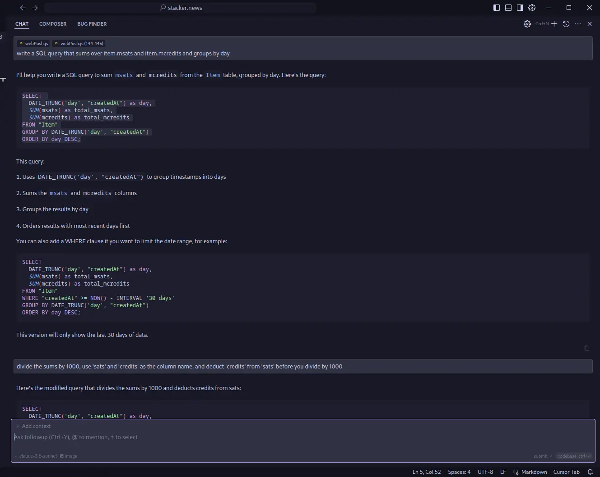
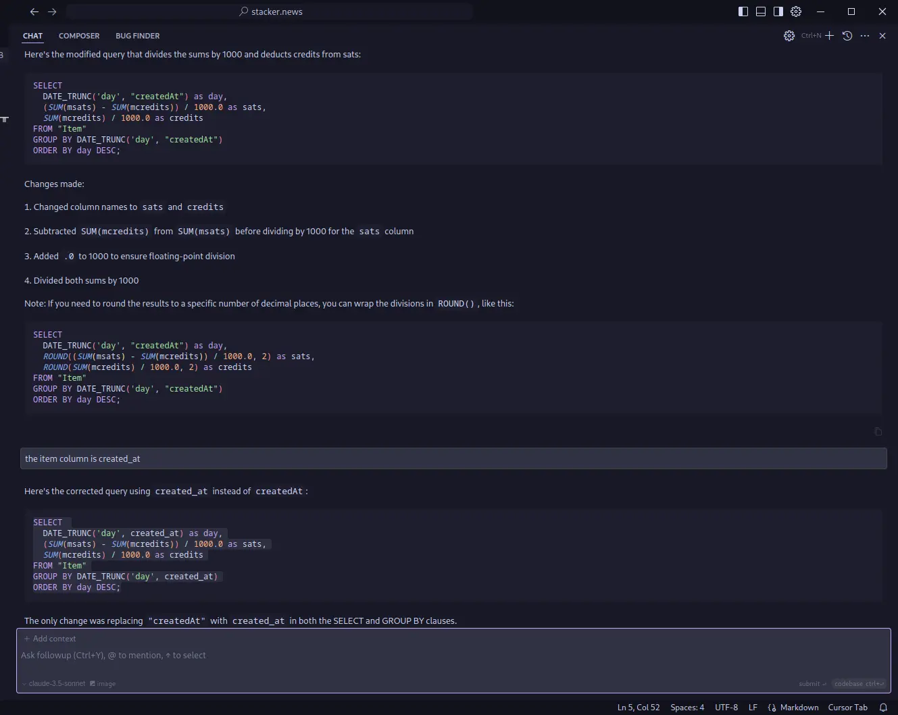
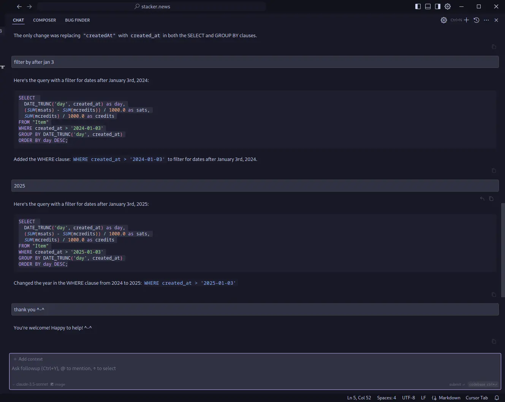

This is a raw example of how useful an AI assistant can be. Instead of using it
to do something you can't do yourself, you use it to do something that isn't
worth your time.

There was some back-and-forth required here so not sure about how much time I
actually saved in this example with a short query, but it was definitely a more
pleasant experience.[^1] Also, you can imagine that any time saved this way sums
up over time. The assistant can probably type faster than you can.

So no, I don't think AI will replace programmers but complement them. I don't
think the job description of a programmer will go away so a "programmer" still
needs to know how to program.

Just like pilots that fly planes with autopilots, they still learn how to fly a
plane themselves and aerodynamics 'n stuff.

[^1]: I could probably have included more context in my prompt. As you can see,
    I even gave it wrong context: I pointed to the code for push notifications.
