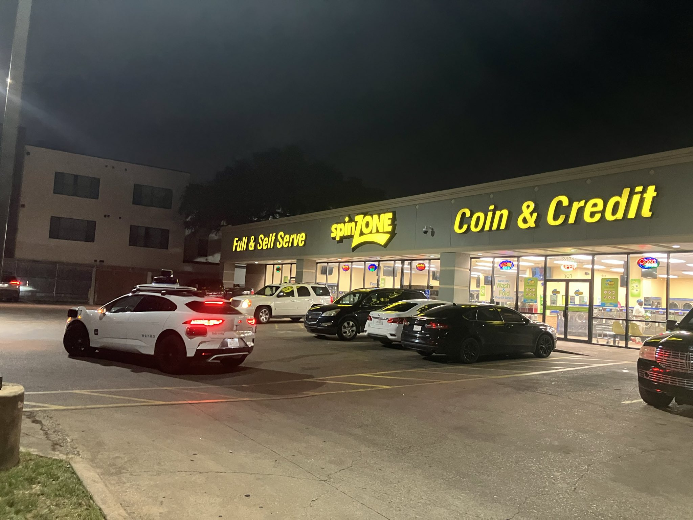

The first thing I see in the morning is the color and brightness of the sky through a small window near the ceiling. It allows me to guess what time it is and I got pretty damn good at it, like Eugene Sledge killing Japs.



---

While getting ready for work, I was thinking about something I don't remember, but it made me write down the following:

> What is the opportunity cost of my thoughts?

Since our thoughts are processed serially, even the time we spend doing nothing but thinking is precious. I shouldn't waste it.

Another cost I need to consider more is the cost of being awake. Depending on how much sleep we need, we know that we will be tired in 14-19 hours again. So if I don't spend the time I am the most awake thinking about my hardest problems, I am also wasting precious time.

---

I really enjoy the introspective part of writing about myself. It's as meta as [strange loops](https://en.wikipedia.org/wiki/Strange_loop). [I am a strange loop](https://en.wikipedia.org/wiki/I_Am_a_Strange_Loop).

_While writing this, I started listening to the preview of the [audio version](https://www.amazon.com/I-Am-Strange-Loop-audiobook/dp/B07HJCBXD8) of_ I Am a Strange Loop _and I really like it. Listening to someone reading a book in English might also help with my pronunciation. Maybe I should start listening to audiobooks since I do struggle with pronunciation?_

---

I had some more notes but I don't want to share them in an unpolished way and I want go to sleep. Maybe I will include them tomorrow.

---

It's cockroach weather in Austin. It's even warm at night now.
