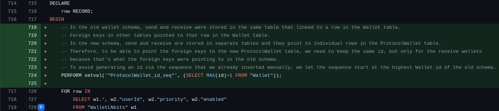

Dear Journal,

You were meant to be a developer diary. You were meant to contain the progress I made every day on the new wallets. You don't, because I was too embarrassed of my progress. I am usually in PlebLab from 12pm to 12am so you would think I get a lot of stuff done. I don't. I am so long in PlebLab _because_ I don't get much stuff done, because I am ashamed of myself, because I think I need to work longer to compensate how slow I am.

I think it's a terrible idea to share this. I'm still considering if I will, but at the same time, it feels important to share this. I will feel relieved.

I also don't want to be a person that can't share their failures.

---

_Disclaimer: all commit timestamps on Github are wrong because I rebase a lot._

Yesterday, I thought I was done with designing the new wallet schema and I could start to update the Javascript code but then I noticed (again) that I forgot that I haven't updated four other tables (`DirectPayment`, `InvoiceForward`, `Withdrawal` and `WalletLog`) yet.

a snippet of the changeset in 25306b34

I updated them in [`bc0df957`](https://github.com/stackernews/stacker.news/pull/2146/commits/bc0df95781815cc00f7781d7cfa8450bbaa72286) but I knew this wasn't going to work because the new wallets will have different IDs. This is what I fixed in [`25306b34`](https://github.com/stackernews/stacker.news/pull/2146/commits/25306b3408cab815810731ce198cdf5568ced630) today. To test that I actually fixed it, I added some payments to my test data in [`a9705e80`](https://github.com/stackernews/stacker.news/pull/2146/commits/a9705e806d61acffb4344c1eba177acad5e6a502).

Fortunately, my test data contained a wallet without any configuration, which meant it wouldn't get migrated to the new schema. For some reason, this turned out to be a problem. I expected such wallets to simply get deleted and any row linking to them removing the link. However, the migration failed because a withdrawal couldn't find the wallet it's linked to anymore. Therefore, I will need to look into this tomorrow. I need to make sure I understand what's going on to be confident in the wallet migration. If something like that happens in production, it's going to be really bad.
