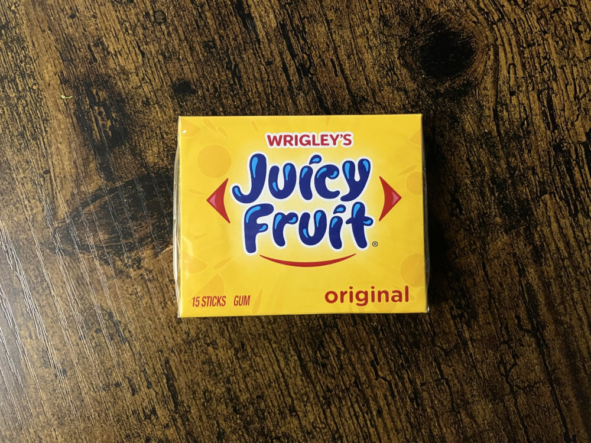

Dear Journal,

You would be nothing without the notes I take each day.

---

There are a lot of notes that I haven't included in any journal yet, and the number is increasing. I usually take more notes per day than I mention in a journal.

One reason for not mentioning some of them is that they are for me, not for you. I still want to include them on my site, though, so I can view them in a nice format. Maybe I'll play around with hidden links and encryption schemes.

Anyway, the number of 'unused notes' helps ensure that I always have something to write to you about. Without them, I probably would have already stopped writing these journals. I really wonder how long I can keep this streak going.

But at the same time, I should prepare myself for the day I skip you, so I don't end up quitting just because I skipped one day.

---

**11am | waking up, still in bed**

If I imagine my thoughts as travel destinations, and thinking as traveling, it's easier not to think about something bad because I'd have to picture myself walking a long way just to arrive at a shitty place. Essentially, I want to add friction to some of my thoughts, like a spam filter ... is there something like this?

**12pm | leaving the hostel room**

Wow, people really like Hollywood Undead here in the US. [Everywhere I Go](https://www.youtube.com/watch?v=A7XDFstVaHA), there's someone telling me they like my favorite hoodie. This time, it was even a girl. We exchanged a few words as she continued down the hallway. She mentioned that HU used to be very popular, but not as much anymore. It was a pleasantly innocent interaction.

---

I wanted to write about my approach to parties yesterday. I didn’t, so I’ll start now:

I think I can be the bubblegum guy who offers people all kinds of bubblegum, so we can chew and blow the wildest bubbles together.

Thanks to bubblegum, I don’t feel like smoking cigarettes anymore. Sounds stupid, but it seems to work.

There’s more to say about how I approach parties (or how I don’t), but maybe another time.

---

I listened to _Frame of Mind_ by Tristam today:



> You can lift your head up to the sky
>
> Take a deeper breath and give it time
>
> You can walk the path along the lines
>
> With your shattered frame of mind
>
> Or instead, you could always stay
>
> We can wait right here and play
>
> Until somehow you can find
>
> A slightly better frame of mind

It’s a song I listened to on repeat when I felt really lost and knew I needed to save myself in 2021.

I was also torn, because I really wanted to take shrooms or acid at the time, to escape my frame of mind, but I knew [that wasn't a good reason](https://stacker.news/items/607554). I also had to think a lot about this quote from Alan Watts:

> When you get the message, hang up the phone.
>
> [For psychedelic drugs are simply instruments, like microscopes, telescopes, and telephones. The biologist does not sit with eye permanently glued to the microscope; he goes away and works on what he has seen.]

and about [the scene in which Elliot cries because he can't hold in his loneliness](https://www.youtube.com/watch?v=cvrDV1uNpxI).

---

I decided today that I won’t be able to ship the wallet changes incrementally, so I will have to ship all the changes at once.

> I decided to merge this into a new branch `wallet-v2` because I don't see a way to get this PR and [#2146](https://github.com/stackernews/stacker.news/pull/2146) merged into `master` without breaking `master` or too much code for backwards-compatibility that is basically dead on arrival.
>
> Therefore, `wallet-v2` will contain all changes to resolve [#1495](https://github.com/stackernews/stacker.news/issues/1495).
>
> Ideally, the PR to merge `wallet-v2` into `master` will simplify a lot. I expect it to remove more code than it adds, so the review of the remaining code should be easy enough.

— me, [Github comment](https://github.com/stackernews/stacker.news/pull/2092#issuecomment-2888730116)

That sucks, because I’m not used to changing so much code at once, but there’s also something relieving about it: everything is fair game now.

I prepared myself for this in commit [`3ba6ca24`](https://github.com/stackernews/stacker.news/pull/2169/commits/3ba6ca2424e1003874761ef4570a26f130f9fc0f). I annotated the existing code with a lot of TODOs and my thoughts on how I think I’m going to change it. I also removed a lot of code where I already knew that updating it would take more time than just starting from scratch.
