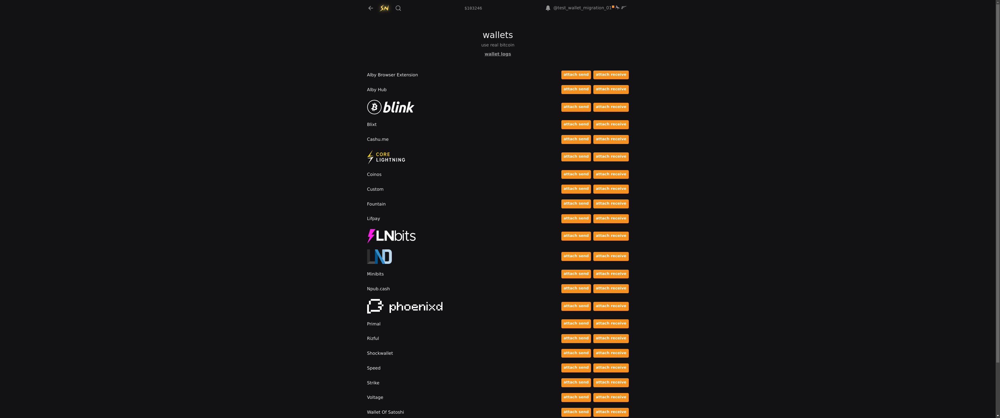

Dear Journal,

I had a funny realization today: I feel like shit because I don't get much stuff done, and I don't get much stuff done because I feel like shit. It's really that simple. 🤯

Therefore, I got some stuff done today so I can stop feeling like shit, so I can get even more stuff done. More about that at the end.

---

_Actually, I don't feel like expanding on any notes today. I also didn't take any that feel important. I tried to write something here about how I have to leave PlebLab soon, and how I really wasn’t looking forward to it at all, but I noticed that it's not all bad. I deleted what I wrote because it felt forced. I don't want to force my journals._

_Maybe I'll skip tomorrow, take a longer break or stop publishing them. I should do more things **exclusively** for myself._

---

I made some visible progress on the wallets today ([`0f8811ea`](https://github.com/stackernews/stacker.news/pull/2169/commits/0f8811ea87991ab79de702321e2cf70008cf265f)):

I also felt more comfortable changing a lot of code. I tend to be very autistic about my commit messages. I want them to be good so I don't lose track of what I'm doing, my progress, or whatever the reason is that I care so much about them. I actually can't really tell you. It just feels like a part of me that I'm afraid of letting go.

But as a girl in PlebLab told me, [my worrying about losing myself](https://stacker.news/items/979677?commentId=980278) if I let go of things that define me but turn out to be mostly harmful upon closer inspection—like worrying too much—is a sign that I don't feel secure about who I am. That made a lot of sense. I will not let good commit messages define me.

I also made some important decisions about how the new code is going to work, without committing too much. I'm not sure yet if those were good decisions, but I want to find out.

I would love to tell you about them, but I need to prioritize sleep. Good sleep habits should define me, and I've sacrificed a lot of sleep for this journal. It was worth it, but maybe not anymore.
