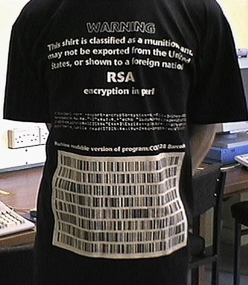

We should never forget that the U.S. government tried to limit export of
cryptography:

> EFF's landmark legal victory in [Bernstein v. Department of
> State](https://www.eff.org/cases/bernstein-v-us-dept-justice) greatly reduced
> the burdens and barriers to exporting open source encryption software,
> including export through publication on the Internet.
>
> Beginning in 1995, EFF represented Daniel J. Bernstein, a Berkeley mathematics
> Ph.D. student, who wished to publish an encryption algorithm he developed in
> the form of source code and a paper describing and explaining the algorithm,
> called Snuffle.
>
> Under the applicable laws at the time — the United States Munitions List of
> the International Traffic in Arms Regulations (ITAR), and later the U.S.
> Export Administration Regulations (EAR) — encryption was considered a military
> technology whose export was strictly regulated in order to preserve a
> competitive security advantage for the U.S.
>
> As a result, the law prohibited publication without prior approval of the
> government, and that prior approval was generally refused except for extremely
> weak encryption. Not only did these regulations chill the speech of
> individuals like Daniel Bernstein, they hampered American business by limiting
> the export of encryption technologies and methods. Then, as now, EFF saw
> clearly the importance of protecting speech online and the necessity of
> encryption to building a web with privacy and security protections.

— [U.S. Export Controls and “Published” Encryption Source Code Explained,
2019](https://www.eff.org/deeplinks/2019/08/us-export-controls-and-published-encryption-source-code-explained)

and encryption to DES by pretending it's secure enough until they couldn't
anymore because the EFF built a DES Cracker for less than $250,000 which could
crack DES encryption in less than 3 days:

> The Electronic Frontier Foundation (EFF) today raised the level of honesty in
> crypto politics by revealing that the Data Encryption Standard (DES) is
> insecure. The U.S. government has long pressed industry to limit encryption to
> DES (and even weaker forms), without revealing how easy it is to crack.
> Continued adherence to this policy would put critical infrastructures at risk;
> society should choose a different course.
> 
> To prove the insecurity of DES, EFF built the first unclassified hardware for
> cracking messages encoded with it. On Wednesday of this week the EFF DES
> Cracker, which was built for less than $250,000, easily won RSA Laboratory's
> "DES Challenge II" contest and a $10,000 cash prize. It took the machine less
> than 3 days to complete the challenge, shattering the previous record of 39
> days set by a massive network of tens of thousands of computers.

— [EFF DES Cracker Machine Brings Honesty To Crypto Debate,
2016](https://www.eff.org/press/releases/eff-des-cracker-machine-brings-honesty-crypto-debate)

Btw, DJB's work is still very relevant. We're still in the
[migration](https://blog.cloudflare.com/it-takes-two-to-chacha-poly/) from AES
to [ChaCha20](https://cr.yp.to/chacha/chacha-20080128.pdf) in various areas. One
of the biggest advantages of ChaCha20 is that [it's faster in software than AES
without compromising on
security](https://crypto.stackexchange.com/questions/34455/whats-the-appeal-of-using-chacha20-instead-of-aes)
(it's even more secure). For example,
[NIP44](https://github.com/nostr-protocol/nips/blob/master/44.md) ([merged just
a few days ago](https://github.com/nostr-protocol/nips/pull/746)) uses ChaCha20.